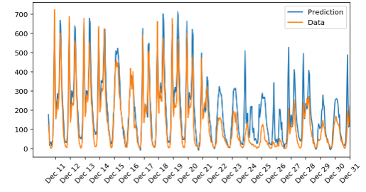

# Project 1 Neural Networks - Predicting Bike-Share Patterns

Here is the introduction from the project page

"In this project, you'll get to build a neural network from scratch to carry out a prediction problem on a real dataset! 
By building a neural network from the ground up, you'll have a much better understanding of gradient descent, backpropagation, 
and other concepts that are important to know before we move to higher level tools such as PyTorch. 
You'll also get to see how to apply these networks to solve real prediction problems!
The data comes from the UCI Machine Learning Database."

This project will test the users ability to create a simple neural net to draw predictions from data.

I had to create a neural network from the ground up and use the gadient descent, backprop etc to get the code to work. 

## Code explanation

### Step 1 : Sigmoid function 

It is first necessary to define the code for the sigmoid function. More specifically its called the logistic sigmoid function. This will be used to transform any real valued input into a probability. This will determine the chance that a bike needs to be used. The equation is as follows:

\begin{equation}
S = 1/(1+e^-x)
\end{equation}

This was easy to define. There was a choice of using a lambda but I opted for the other option. 

### Step 2: Define Forward Pass

I need to now define the forward pass for backpropagation. 

### Step 3: Define Backward Propagation

### Step 4: Train network

The training took about 3-4 minutes to train. It acquired a training loss of .056 and a validation loss of .156. This means that the network is doing well not only on predictions inside the training set but is capable of extrapolating the results towards new data points. 

### Step 4: Run the actual network 

This is the final result. It looks like the neural network is accurately predicting when the bike usage spikes. 

