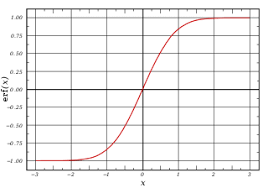

# Project 1 Neural Networks - Predicting Bike-Share Patterns

Here is the introduction from the project page

"In this project, you'll get to build a neural network from scratch to carry out a prediction problem on a real dataset! 
By building a neural network from the ground up, you'll have a much better understanding of gradient descent, backpropagation, 
and other concepts that are important to know before we move to higher level tools such as PyTorch. 
You'll also get to see how to apply these networks to solve real prediction problems!
The data comes from the UCI Machine Learning Database."

This project will test the users ability to create a simple neural net to draw predictions from data.

I had to create a neural network from the ground up and use the gadient descent, backprop etc to get the code to work. 

## Code explanation

### Step 1 : Sigmoid function 

It is first necessary to define the code for the sigmoid function. More specifically its called the logistic sigmoid function. This will be used to transform any real valued input into a probability. This will determine the chance that a bike needs to be used. The equation is as follows:

 S(x) = 1/ (1 + e^-x)

This was easy to define. There was a choice of using a lambda but I opted for the other option. 

### Step 2: Define Forward Pass

In order to get started, it is first necessary to perform forward propagation.  

So what is forward propagation?

Its the operation that applies the weights of the neurons in the hidden layers to the input to create an ouptut. 

Lets say we had a column vector with a bias unit as follows : [x1; x2; 1] 

Then matrices, W1 and W2 with weights [W11, W12; W21, W22; W31, W32] and [W22; W11; W33] 

It is first necessary to multiply the input by the matrix W1. Then its necessary to apply an activation function so that the results are between 0 and 1. 
These results are then multiplied with the new matrix W2. This result then undergoes the activation function again in order to modify the results to be between 0 and 1. 
The final result acquired is y hat. The result that our network generates. 

This is the first result we need. Now it is time to move on to the calculation of the error function.

### Step 3: Calculating the error function
So now we have y hat. How do we know if this result is correct though? Well, it is necessary to compare the network result to the ground truth of y. This is where the error function comes into action. 

The error function is given as follows 

### Step 3: Define Backward Propagation

So now we have y hat. How do we know if this result is correct though? Well, it is necessary to compare the network result to the ground truth of y. This is where backpropagation comes into action. 

### Step 4: Train network

The training took about 3-4 minutes to train. It acquired a training loss of .056 and a validation loss of .156. This means that the network is doing well not only on predictions inside the training set but is capable of extrapolating the results towards new data points. 

### Step 4: Run the actual network 

This is the final result. It looks like the neural network is accurately predicting when the bike usage spikes. 

