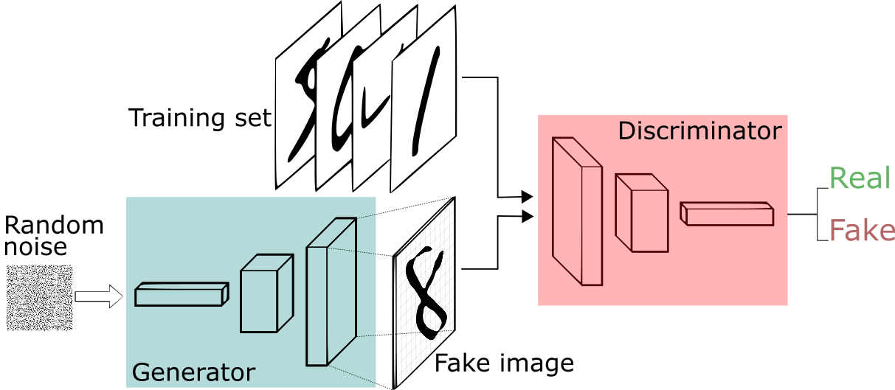

# Project 5 - Generating Faces

This project tasks you with creating a generator and discriminator to make new face images from a corpus of celebrity images. 

Download the repo and run the scripts. I would recommend using google collaboratory as there is a GPU that can speed up processing time. 

This code has you creating a generator and a discriminator network. The generator creates faces that the discriminator has to identify as bad. This forces the generator to get increasingly better at generating faces in order to fool the discriminator. 




## Code instructions

1. Clone the repository and navigage to the downloaded folder.
	```
		git clone https://github.com/JonHasan/DeepLearning-Nanodegree/tree/master/Project%205%20-%20Generating%20Faces
		cd Face-Generation
	```
2. Open the `dlnd_face_generation.ipynb` file
	```
		jupyter notebook dlnd_face_generation.ipynb
	```
3. Read and follow the instructions. 
